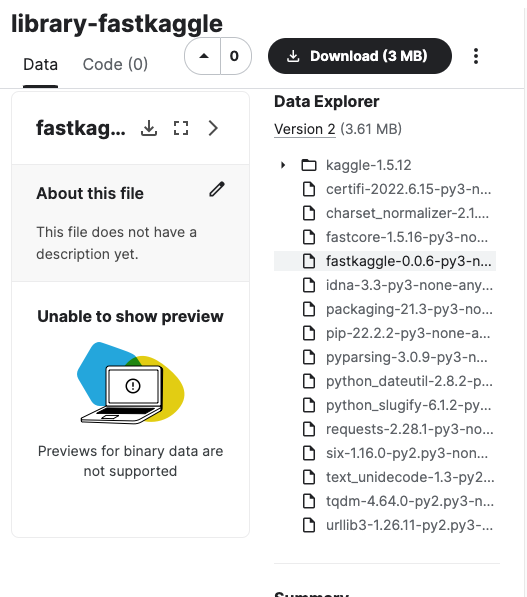

fastkaggle
================

<!-- WARNING: THIS FILE WAS AUTOGENERATED! DO NOT EDIT! -->

## Install

Either:

    pip install fastkaggle

or:

    mamba install -c fastai fastkaggle

(or replace `mamba` with `conda` if you don’t mind it taking much longer
to run…)

## How to use

### Competition

This little library is where I’ll be putting snippets of stuff which are
useful on Kaggle. Functionality includes the following:

It defines
[`iskaggle`](https://fastai.github.io/fastkaggle/core.html#iskaggle)
which is `True` if you’re running on Kaggle:

``` python
'Kaggle' if iskaggle else 'Not Kaggle'
```

    'Not Kaggle'

It provides a
[`setup_comp`](https://fastai.github.io/fastkaggle/core.html#setup_comp)
function which gets a path to the data for a competition, downloading it
if needed, and also installs any modules that might be missing or out of
data if running on Kaggle:

``` python
setup_comp('titanic')
```

    Path('titanic')

There’s also
[`push_notebook`](https://fastai.github.io/fastkaggle/core.html#push_notebook)
to push a notebook to Kaggle Notebooks, and
[`import_kaggle`](https://fastai.github.io/fastkaggle/core.html#import_kaggle)
to use the Kaggle API (even when you’re on Kaggle!) See the
`fastkaggle.core` docs for details.

### Datasets

This section is designed to make uploading pip libraries to kaggle
datasets easy. There’s 2 primary high level functions to be used. First
we can define our kaggle username and the local path we want to use to
store datasets when we create them.

<div>

> **Usage tip**
>
> The purpose of this is to create datasets that can be used in no
> internet inference competitions to install libraries using
> `pip install -Uqq library --no-index --find-links=file:///kaggle/input/your_dataset/`

</div>

``` python
lib_path = Path('/root/kaggle_datasets')
username = 'isaacflath'
```

#### List of Libraries

We can take a list of libraries and upload them as seperate datasets.
For example the below will create a `library-fastcore` and
`library-timm` dataset. If they already exist, it will push a new
version if there is a more recent version available.

``` python
libs = ['fastcore','timm']
create_libs_datasets(libs,lib_path,username)
```

    Processing fastcore as library-fastcore at /root/kaggle_datasets/library-fastcore
    -----Downloading or Creating Dataset
    -----Checking dataset version against pip
    -----Kaggle dataset already up to date 1.5.16 to 1.5.16
    Processing timm as library-timm at /root/kaggle_datasets/library-timm
    -----Downloading or Creating Dataset
    -----Checking dataset version against pip
    -----Kaggle dataset already up to date 0.6.7 to 0.6.7
    Complete

This creates datasets in kaggle with the needed files.


#### requirements.txt

We can also create a singular dataset with multiple libraries based on a
`requirements.txt` file for the project. If there are any different
files it will push a new version.

``` python
create_requirements_dataset('test_files/requirements.txt',lib_path,'libraries-pawpularity', username)
```

    Processing libraries-pawpularity at /root/kaggle_datasets/libraries-pawpularity
    -----Downloading or Creating Dataset
    Data package template written to: /root/kaggle_datasets/libraries-pawpularity/dataset-metadata.json
    -----Checking dataset version against pip
    -----Updating libraries-pawpularity in Kaggle
    Complete

This creats a dataset in kaggle with the needed files.


